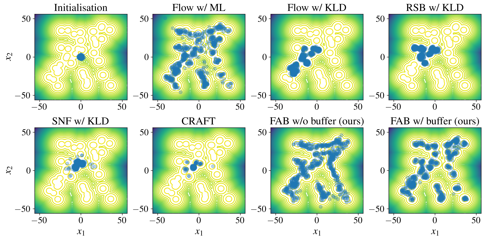
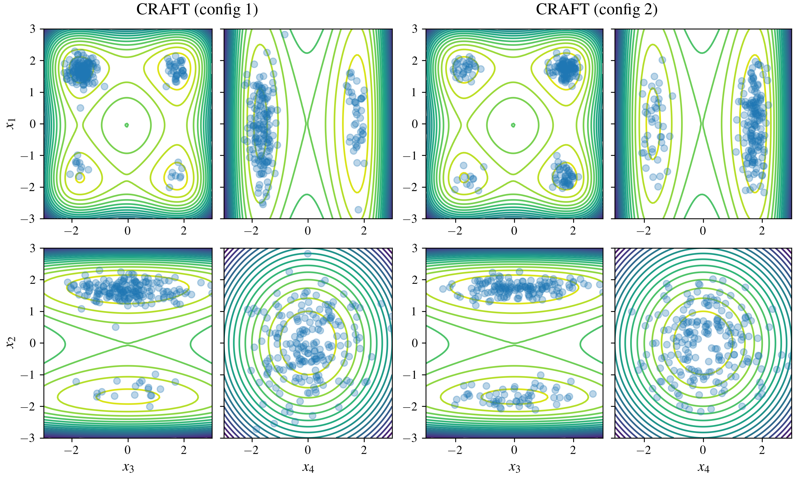

# Continual Repeated Annealed Flow Transport Monte Carlo (CRAFT)

This is a fork of the CRAFT repo that is used to evaluate the CRAFT model on the GMM and Many Well problems for 
our paper [Flow Annealed Importance Sampling Bootstrap](https://arxiv.org/abs/2208.01893).
We show that our method (FAB) significantly outperforms CRAFT on the GMM problem - CRAFT fails to capture all the modes in the target distribution on this problem.
On the Many Well problem both FAB and CRAFT perform well, where both methods capture the modes in the target distribution well.

Colab notebook for running experiment for GMM problem:

[Notebook](craft_manywell_train_eval.ipynb) for running experiment for Many Well Problem

### GMM plot (CRAFT fails):

### Many Well plot (CRAFT performs well):

